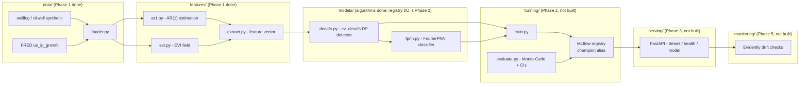

# ev-decafs-serve

[](https://github.com/dasagniva/ev-decafs-serve/actions/workflows/ci.yaml)

[](LICENSE)


A production MLOps envelope around [EV-DeCAFS](#design-decisions-and-limitations) — a
published two-phase statistical pipeline for changepoint detection and classification in
univariate time series with AR(1) noise and heavy-tailed excursions. This repo does not contain
new modeling research; it packages, tests, tracks, serves, containerizes, and monitors an
existing, published model. Optimized for legibility, honesty, and reproducibility over feature
count.

> **Project status:** Phase 1 of 5 complete (packaging, ported algorithm code, tests, CI).
> Training/MLflow (Phase 2), the FastAPI serving layer (Phase 3), containerization (Phase 4),
> and drift monitoring (Phase 5) are not built yet — see [Roadmap](#roadmap) below. Sections
> below that depend on those phases are marked `TBD` rather than filled with placeholder
> numbers or commands that don't actually work yet.

---

## Results

`TBD — pending reproduction run.`

No training or evaluation pipeline has been run inside this repo yet (that's Phase 2). The
research repo this is built on reports a balanced accuracy of roughly 0.80 with wide
Monte-Carlo confidence intervals across replications — intervals that wide are a deliberate
feature of the evaluation design, not noise to be hidden, because they reflect real sampling
variability in detecting changepoints in heavy-tailed series, not a single lucky run. This
table will be filled in with the actual number this repo's own `scripts/evaluate.py` produces,
logged to MLflow, once Phase 2 lands — never copied from the research repo's own reports.

---

## Quickstart

The Phase 4 Docker quickstart (`docker compose up` → `curl /detect`) doesn't exist yet. What
works today is the development quickstart:

```bash
git clone https://github.com/dasagniva/ev-decafs-serve.git
cd ev-decafs-serve
uv sync --all-extras
uv run pytest --cov=src --cov-fail-under=60
```

---

## Architecture

Target architecture once all phases land (current Phase 1 scope highlighted):



---

## Applications

**Quantitative finance — regime detection (primary use case).** The `us_ip_growth` dataset
(FRED `INDPRO`, US Industrial Production month-over-month growth) is evaluated against NBER
recession dates as ground truth. The detector targets exactly the kind of **structural breaks**
that matter in macro/financial time series: regime shifts at recession onsets and recoveries,
embedded in **autocorrelated noise** (the series is modeled with an explicit AR(1) noise
process, not assumed i.i.d.). The Phase-II classifier distinguishes a genuine regime change
("sustained") from a transient shock ("recoiled") using, among other features, a local
**extreme-value tail behaviour** signal (the EVI/GPD shape parameter) — so a single outlier
print doesn't get mistaken for a new regime.

**Sensor/industrial benchmarks (secondary).** `welllog` and `oilwell` are synthetic surrogates
with known changepoints and injected outlier spikes, used to validate detector and classifier
behaviour against ground truth before trusting the model on real macro data.

---

## Evaluation methodology

Classification performance is assessed via Monte-Carlo replication, not a single train/test
split: many synthetic series are generated with the same statistical character (AR(1)
autocorrelation, jump magnitudes, outlier rates) as empirically estimated from each real
dataset, the full pipeline is run on each replicate, and the resulting metric distribution
(mean, std, 2.5/97.5 percentile CI) is reported — see
`src/evdecafs_serve/training/` (Phase 2, not yet built) and the research repo's
`evaluation/monte_carlo.py` it's ported from. Wide confidence intervals are reported
deliberately rather than a single point estimate, because a single run's balanced accuracy is
not a reliable summary of how the detector behaves across the range of changepoint/outlier
configurations a real series could present.

---

## Design decisions and limitations

Full reasoning and rejected alternatives are logged in [`DECISIONS.md`](DECISIONS.md). Key
points:

- **Consumption mode:** algorithms are extracted and repackaged from the published research
  repo (`changepoint-evdecafs`), not vendored wholesale or depended on as a git dependency.
- **Flat Phase-I penalty:** the changepoint detector (`models/decafs.py`) always uses a flat
  penalty schedule. The research repo's GPD-adaptive penalty variant is real but unused in
  production — extreme-value information enters only through a Phase-II classifier feature.
- **`n_grid=1000`:** the detector's discretisation grid is pinned to the value that actually
  produced every existing reported metric (the research repo's own internal docs claimed 500
  and were stale).
- **Known limitation — no changepoint-location uncertainty:** the only uncertainty signal
  available is the Phase-II classifier's probability margin (sustained vs. recoiled). There is
  no bootstrap or other mechanism for a changepoint-*location* confidence interval; the serving
  API will not claim one.

---

## Development guide

```bash
uv sync --all-extras                 # install deps + dev tools
uv run pytest --cov=src              # run tests with coverage
uv run ruff check . && uv run ruff format --check .   # lint + format check
uv run mypy src/evdecafs_serve/serving                 # type check (scope widens as serving/ grows)
```

MLflow UI (`uv run mlflow ui`) and the model promotion script (`scripts/promote_model.py`)
don't exist yet — Phase 2.

---

## Roadmap

Deliberately deferred, in order:

- **Phase 2** — `scripts/train.py` / `scripts/evaluate.py`, MLflow tracking + `@champion`
  registry alias, the real Monte-Carlo reproduction run (human-confirmed before any number goes
  in the Results table above).
- **Phase 3** — FastAPI serving layer (`/detect`, `/health`, `/model`), Pydantic v2 request
  validation, contract tests.
- **Phase 4** — multi-stage Dockerfile, `docker compose`, containerized smoke test, the 3-command
  quickstart this README currently lacks.
- **Phase 5** — Evidently-based input drift monitoring, one short load test, final polish of
  this README (this section will shrink as each item lands).

See [`ROADMAP-repo1-ev-decafs-serve.md`](ROADMAP-repo1-ev-decafs-serve.md) for full phase
acceptance criteria, and [`INTAKE.md`](INTAKE.md) for the research-code intake notes that
informed the decisions above.
