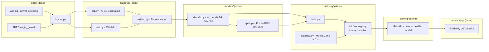

# ev-decafs-serve

[](https://github.com/dasagniva/ev-decafs-serve/actions/workflows/ci.yaml)

[](LICENSE)


A production MLOps envelope around [EV-DeCAFS](#design-decisions-and-limitations) — a
published two-phase statistical pipeline for changepoint detection and classification in
univariate time series with AR(1) noise and heavy-tailed excursions. This repo does not contain
new modeling research; it packages, tests, tracks, serves, containerizes, and monitors an
existing, published model. Optimized for legibility, honesty, and reproducibility over feature
count.

> **Project status:** all five phases complete — packaging + tests + CI (1), training pipeline +
> MLflow registry (2), FastAPI serving (3), Docker/compose containerization (4), and Evidently
> drift monitoring + load test (5). Results below are from this repo's own evaluation pipeline,
> not copied from the research repo.

---

## Results

Produced by **this repo's own** `scripts/evaluate.py` (not copied from the research repo).
Monte-Carlo evaluation of the EV-DeCAFS / FourierPNN classifier on synthetic well-log-style
series (`n_grid=1000`, `B=40` replications, 27 usable; seed 42):

| Metric | Mean | 95% CI |
|---|---|---|
| Balanced accuracy | **0.785** | [0.50, 1.00] |
| Matthews corr. coef. | 0.558 | [0.00, 1.00] |
| AUC-ROC | 0.940 | [0.61, 1.00] |

The balanced accuracy (≈0.79) is in line with the model's published ≈0.80. The **wide
confidence intervals are deliberate rigour, not noise to hide**: each replication is a fresh
synthetic series, so the spread reflects real sampling variability in detecting changepoints in
heavy-tailed, autocorrelated data — far more honest than a single lucky train/test split. A
larger `B` (and a sweep across all three datasets) tightens the intervals; see
[Roadmap](#roadmap).

---

## Quickstart

**Docker (serves the API).** From a fresh clone, with only Docker installed:

```bash
git clone https://github.com/dasagniva/ev-decafs-serve.git && cd ev-decafs-serve
docker compose -f docker/compose.yaml up -d --build --wait
curl -X POST localhost:8000/detect -H 'Content-Type: application/json' -d @examples/welllog.json
```

On first boot the `api` container trains and promotes a quick, **offline** welllog model so
`/detect` works immediately; later boots reuse the persisted model. The MLflow UI is at
`localhost:5000`. `GET /health` and `GET /model` describe the served model. For a
production-quality model, retrain with a full config:

```bash
docker compose -f docker/compose.yaml exec api \
  python /app/scripts/train.py --config /app/configs/welllog.yaml --promote
```

**Local development (no Docker).**

```bash
git clone https://github.com/dasagniva/ev-decafs-serve.git && cd ev-decafs-serve
uv sync --all-extras
uv run pytest --cov=src --cov-fail-under=60
uv run uvicorn evdecafs_serve.serving.app:app   # needs a champion: see scripts/train.py --promote
```

---

## Architecture

Architecture (all stages built):



---

## Applications

**Quantitative finance — regime detection (primary use case).** The `us_ip_growth` dataset
(FRED `INDPRO`, US Industrial Production month-over-month growth) is evaluated against NBER
recession dates as ground truth. The detector targets exactly the kind of **structural breaks**
that matter in macro/financial time series: regime shifts at recession onsets and recoveries,
embedded in **autocorrelated noise** (the series is modeled with an explicit AR(1) noise
process, not assumed i.i.d.). The Phase-II classifier distinguishes a genuine regime change
("sustained") from a transient shock ("recoiled") using, among other features, a local
**extreme-value tail behaviour** signal (the EVI/GPD shape parameter) — so a single outlier
print doesn't get mistaken for a new regime.

**Sensor/industrial benchmarks (secondary).** `welllog` and `oilwell` are synthetic surrogates
with known changepoints and injected outlier spikes, used to validate detector and classifier
behaviour against ground truth before trusting the model on real macro data.

---

## Evaluation methodology

Classification performance is assessed via Monte-Carlo replication, not a single train/test
split: many synthetic series are generated with the same statistical character (AR(1)
autocorrelation, jump magnitudes, outlier rates) as empirically estimated from each real
dataset, the full pipeline is run on each replicate, and the resulting metric distribution
(mean, std, 2.5/97.5 percentile CI) is reported — see
`src/evdecafs_serve/training/evaluate.py` (run via `scripts/evaluate.py --config ...`). Wide
confidence intervals are reported
deliberately rather than a single point estimate, because a single run's balanced accuracy is
not a reliable summary of how the detector behaves across the range of changepoint/outlier
configurations a real series could present.

---

## Design decisions and limitations

Full reasoning and rejected alternatives are logged in `DECISIONS.md`. Key
points:

- **Consumption mode:** algorithms are extracted and repackaged from the published research
  repo (`changepoint-evdecafs`), not vendored wholesale or depended on as a git dependency.
- **Flat Phase-I penalty:** the changepoint detector (`models/decafs.py`) always uses a flat
  penalty schedule. The research repo's GPD-adaptive penalty variant is real but unused in
  production — extreme-value information enters only through a Phase-II classifier feature.
- **`n_grid=1000`:** the detector's discretisation grid is pinned to the value that actually
  produced every existing reported metric (the research repo's own internal docs claimed 500
  and were stale).
- **Product, not a second reproduction site:** this repo optimises for a scalable, servable,
  honestly-measured model; the published-metric reproduction lives in the research repo. The
  algorithm ports stay byte-faithful, but training-time choices (hand-rolled SMOTE instead of
  `imbalanced-learn`, FPNN-only evaluation with no comparison baselines) favour a lean image.
- **Input-drift monitoring:** `GET /monitoring/drift` compares sliding-window summary features
  (`mean`, `std`, `range`) of recent `/detect` traffic to a reference profile baked into the
  model bundle at train time, via Evidently's K-S data-drift test. `scripts/make_drift_report.py`
  writes a standalone HTML report.
- **Known limitation — no changepoint-location uncertainty:** the only uncertainty signal
  available is the Phase-II classifier's probability margin (sustained vs. recoiled). There is
  no bootstrap or other mechanism for a changepoint-*location* confidence interval; the serving
  API will not claim one.

---

## Development guide

```bash
uv sync --all-extras                 # install deps + dev tools
uv run pytest --cov=src              # run tests with coverage
uv run ruff check . && uv run ruff format --check .   # lint + format check
uv run mypy src/evdecafs_serve/serving                 # type check (scope widens as serving/ grows)
```

Train, evaluate, promote, and monitor a model:

```bash
uv run scripts/train.py --config configs/welllog.yaml --promote   # train + register + @champion
uv run scripts/evaluate.py --config configs/welllog.yaml          # Monte-Carlo metrics -> MLflow
uv run scripts/promote_model.py --latest                          # move @champion to newest version
uv run scripts/make_drift_report.py --demo --shift 40000 --output drift.html   # Evidently report
uv run mlflow ui                                                  # browse runs + registry
```

**Load test (one short run).** Against the containerised API (or a local `uvicorn`):

```bash
uvx locust -f locustfile.py --headless -u 20 -r 10 -t 30s --host http://localhost:8000
```

Indicative numbers from a 30 s run at 20 concurrent users against a single local `uvicorn`
worker (`n_grid=250`, 170-point payload): **`POST /detect` ≈ 19 req/s, p50 ≈ 0.74 s,
p95 ≈ 1.2 s, 0 failures.** Latency is dominated by the `ev_decafs` dynamic program
(O(n·n_grid²)) and is single-worker bound — the honest scaling lever is `n_grid` and/or more
workers, not the classifier. Modest by design; numbers over flexing.

---

## Roadmap

All five phases are complete: **(1)** packaging, ported algorithms, tests, CI · **(2)**
`scripts/train.py` / `scripts/evaluate.py`, MLflow tracking + `@champion` registry alias ·
**(3)** FastAPI serving (`/detect`, `/health`, `/model`, Pydantic v2 validation, contract
tests) · **(4)** multi-stage Dockerfile + `docker compose` (api + mlflow services),
containerized smoke test in CI, 3-command quickstart · **(5)** Evidently input-drift monitoring
(`/monitoring/drift`, HTML report), load test, coverage gate at 80%.

Deliberately deferred (honest scope): a full `B=200`, `n_grid=1000` reproduction sweep across
all three datasets (the Results table reports a `B=40` welllog run — larger `B` tightens the
CIs); per-changepoint **location** confidence intervals (no validated method exists upstream);
authentication / rate-limiting on the API; and a hosted MLflow backend (local SQLite today).

See `ROADMAP-repo1-ev-decafs-serve.md` for full phase acceptance criteria, `DECISIONS.md` for
design decisions (incl. the product-vs-reproduction framing), and `INTAKE.md` for the
research-code intake notes.
